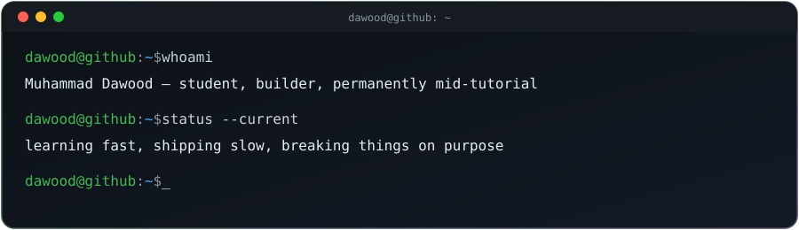

<div align="center">
  
</div>

<br/>

```
$ cat about.md
```

I'm Dawood — a student who learns best by breaking things and figuring out why.
No polished origin story, no "10x developer" arc. Just someone who opens a
blank file, gets curious, and follows it until something works.

⬅️ **EDIT**: rewrite the paragraph above in your own words. This is the one
part of the whole profile that should sound like nobody but you — two or
three honest sentences beat any generated bio.

<br/>

```
$ cat currently.yaml
```

<table>
<tr><td>

```yaml
studying:   ⬅️ your degree / field
learning:   ⬅️ the thing you're mid-way through right now
building:   ⬅️ a project you're actually working on
stuck_on:   ⬅️ something you haven't figured out yet (this is the honest one)
next_goal:  ⬅️ one concrete thing, not "get better at coding"
```

</td></tr>
</table>

<br/>

```
$ ls skills/
```

Instead of an icon wall, here's what I actually reach for and why:

| area | tools | comfort |
|---|---|---|
| ⬅️ e.g. `core` | ⬅️ Python, JS | ⬅️ "can build with it" |
| ⬅️ e.g. `web` | ⬅️ HTML/CSS, React | ⬅️ "learning, not fluent" |
| ⬅️ e.g. `tools` | ⬅️ Git, VS Code | ⬅️ "daily driver" |
| ⬅️ e.g. `exploring` | ⬅️ pick one | ⬅️ "curious, not confident yet" |

> Delete the honesty filter if you want, but "learning, not fluent" reads a lot
> more credible to anyone reviewing your profile than a row of maxed-out badges.

<br/>

```
$ git log --oneline --graph
```

* ⬅️ `[repo-name]` — one line on what it does and why you built it, not what tech it uses
* ⬅️ `[repo-name]` — same idea; the *why* is what makes it memorable
* ⬅️ `[repo-name]` — if it's unfinished, say so — "still working on X" is more real than silence

Link each repo name to the actual GitHub URL, e.g. `[repo-name](https://github.com/MuhammadDawood-1/repo-name)`.

<br/>

```
$ cat philosophy.txt
```

⬅️ One or two lines that sound like you — a principle you code by, a thing
you tell yourself when stuck, or just how you think about learning. This is
the line people remember after they close the tab.

<br/>

<div align="center">

```
$ contact --open-to collaboration,questions,feedback
```

⬅️ [email](mailto:you@example.com) · ⬅️ [linkedin](https://linkedin.com/in/you) · ⬅️ [twitter](https://twitter.com/you)

</div>

<br/>

<div align="center">
  <sub>if you made it this far — thanks for actually reading, not just skimming badges</sub>
</div>
